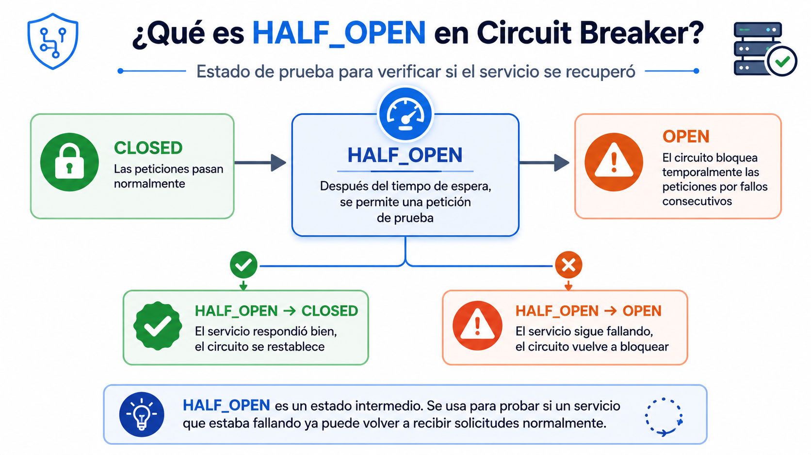

# Laboratorio - Circuit Breaker

Implementación del patrón **Circuit Breaker** usando microservicios con **Flask** y **Docker Compose**.

El objetivo del laboratorio es analizar el comportamiento de un sistema distribuido ante fallos de servicios y aplicar mecanismos de resiliencia mediante los estados:

- `CLOSED`
- `OPEN`
- `HALF_OPEN`

---

## Integrante

- Juan David Bolaños Galindo

---

## Descripción

Este laboratorio implementa el patrón **Circuit Breaker** en un sistema tipo **Pet Shop** con varios servicios.

El sistema cuenta con un **gateway en Flask**, encargado de recibir las peticiones del usuario y redirigirlas a los servicios correspondientes:

- Mascotas
- Usuarios
- Relación mascota-usuario
- Resumen

El Circuit Breaker permite controlar los fallos de los servicios. Si un servicio deja de responder, el gateway no insiste de manera indefinida, sino que abre el circuito, bloquea temporalmente las peticiones y luego realiza una prueba para verificar si el servicio se recuperó.

---

## Tecnologías utilizadas

- Python
- Flask
- Docker
- Docker Compose
- Requests
- Variables de entorno `.env`

---

## Requisitos

Para ejecutar el proyecto se necesita:

- Docker Desktop

---

## Estructura del repositorio

```bash
laboratorio_circuit_breaker/
├── docker-compose.yml
├── .env
├── .env.example
├── .gitignore
├── README.md
├── gateway/
│   ├── app.py
│   ├── Dockerfile
│   └── requirements.txt
├── usuarios/
│   ├── app.py
│   ├── Dockerfile
│   └── requirements.txt
├── backend/
│   ├── app.py
│   ├── Dockerfile
│   └── requirements.txt
├── db/
│   └── init.sql
└── evidencias/
    ├── fase1.png
    ├── fase2.png
    ├── fase3.png
    ├── fase4.png
    └── fase5.png
    └── half-open-circuit-breaker.png
```

> El archivo `.env` no debe subirse al repositorio. Solo se debe subir `.env.example`.

---

## Cómo ejecutar el proyecto

### 1. Clonar el repositorio

```bash
git clone URL_DEL_REPOSITORIO
```

---

### 2. Entrar a la carpeta del proyecto

```bash
cd laboratorio_circuit_breaker
```

---

### 3. Crear el archivo `.env`

```bash
cp .env.example .env
```

---

### 4. Levantar los servicios

```bash
docker compose up --build
```

---

### 5. Verificar contenedores activos

```bash
docker compose ps
```

---

### 6. Ver logs del gateway

```bash
docker compose logs -f gateway
```

---

## Endpoints disponibles

| Endpoint | URL | Descripción |
|---|---|---|
| `/mascotas` | `http://localhost:5000/mascotas` | Lista las mascotas |
| `/usuarios` | `http://localhost:5000/usuarios` | Lista los usuarios |
| `/resumen` | `http://localhost:5000/resumen` | Muestra información combinada |
| `/relacion` | `http://localhost:5000/relacion` | Relaciona mascotas con usuarios |
| `/estado` | `http://localhost:5000/estado` | Muestra el estado de los circuitos |

---

## Configuración del Circuit Breaker

Los parámetros del sistema se configuran desde el archivo `.env`.

```env
# Número de fallos consecutivos para abrir el circuito
CB_UMBRAL_FALLOS=3

# Tiempo de espera antes de intentar recuperación
CB_TIEMPO_ESPERA=15

# Timeout HTTP por petición
CB_TIMEOUT_HTTP=2
```

---

## Funcionamiento del Circuit Breaker

El sistema implementa los tres estados principales del patrón Circuit Breaker:

| Estado | Descripción |
|---|---|
| `CLOSED` | El servicio funciona normalmente y las peticiones pasan |
| `OPEN` | El circuito se abre porque el servicio falló varias veces |
| `HALF_OPEN` | Se permite una petición de prueba para validar si el servicio se recuperó |

---

## Flujo del circuito

```txt
CLOSED ──(fallos consecutivos)──► OPEN
OPEN ──(tiempo de espera)───────► HALF_OPEN
HALF_OPEN ──(éxito)─────────────► CLOSED
HALF_OPEN ──(fallo)─────────────► OPEN
```

---

# FASE 1 – OBSERVAR

## Objetivo

Analizar el comportamiento del sistema cuando se apaga un servicio y observar cómo responde el gateway ante los fallos.

---

## Procedimiento

Se apagó el servicio de mascotas:

```bash
docker compose stop backend
```

Luego se realizaron peticiones al endpoint:

```txt
http://localhost:5000/mascotas
```

También se revisaron los logs del gateway:

```bash
docker compose logs -f gateway
```

---

## Resultado observado

El gateway intentó comunicarse con el servicio de mascotas, pero como el servicio estaba apagado, empezó a registrar fallos.

Después de varios intentos fallidos, el Circuit Breaker abrió el circuito para evitar seguir enviando peticiones a un servicio que no estaba disponible.

---

## ¿Se protege o insiste?

El sistema se protege, porque cuando el circuito pasa a estado `OPEN`, deja de enviar peticiones al servicio caído durante un tiempo definido.

---

## Evidencia


---

# FASE 2 – APLICAR

## Objetivo

Extender el patrón Circuit Breaker a varios servicios del sistema usando una clase reutilizable.

---

## Qué se hizo

Se aplicó el Circuit Breaker a varios endpoints del gateway:

```txt
/mascotas
/usuarios
/relacion
/resumen
```

Se creó un circuito independiente por servicio:

```python
cb_mascotas = CircuitBreaker("mascotas", CB_UMBRAL_FALLOS, CB_TIEMPO_ESPERA)

cb_usuarios = CircuitBreaker("usuarios", CB_UMBRAL_FALLOS, CB_TIEMPO_ESPERA)

cb_relacion = CircuitBreaker("relacion", CB_UMBRAL_FALLOS, CB_TIEMPO_ESPERA)
```

---

## Decisiones tomadas

Se decidió manejar un circuito independiente para cada servicio.

Esto permite que si falla el servicio de mascotas, el servicio de usuarios pueda seguir funcionando normalmente.

También se decidió configurar los parámetros desde el archivo `.env`, para no dejar valores fijos dentro del código.

---

## Evidencia


---

# FASE 3 – INVESTIGAR

## Objetivo

Comprender el funcionamiento del estado `HALF_OPEN` dentro del patrón Circuit Breaker.

---

## ¿Qué significa HALF_OPEN?

`HALF_OPEN` es un estado de prueba.

Cuando el circuito está en `OPEN`, el sistema bloquea temporalmente las peticiones. Después de cumplirse el tiempo de espera configurado, el circuito pasa a `HALF_OPEN`.

En ese momento, el gateway permite una petición de prueba para verificar si el servicio ya se recuperó.

### Imagen explicativa de HALF_OPEN

<p align="center">
  
</p>

---

## ¿Qué pasa si la prueba funciona?

Si la petición funciona correctamente, el circuito vuelve a estado `CLOSED`.

```txt
HALF_OPEN → CLOSED
```

---

## ¿Qué pasa si la prueba falla?

Si la petición vuelve a fallar, el circuito regresa al estado `OPEN`.

```txt
HALF_OPEN → OPEN
```

---

## Evidencia


---

# FASE 4 – IMPLEMENTAR

## Objetivo

Implementar la recuperación automática del circuito después de un tiempo de espera.

---

## Qué se hizo

Se implementó la lógica para que el circuito pase automáticamente de `OPEN` a `HALF_OPEN` cuando se cumple el tiempo configurado.

Código principal:

```python
if self.estado == self.OPEN:
    if time.time() - self.tiempo_apertura >= self.tiempo_espera:
        self.estado = self.HALF_OPEN
```

---

## Procedimiento de prueba

Primero se apagó el servicio:

```bash
docker compose stop backend
```

Luego se hicieron peticiones a:

```txt
http://localhost:5000/mascotas
```

Después se volvió a iniciar el servicio:

```bash
docker compose start backend
```

Cuando pasó el tiempo definido, el circuito pasó a `HALF_OPEN`.

Si la petición de prueba funcionaba, el circuito volvía a `CLOSED`.

---

## Parámetros usados

| Variable | Valor |
|---|---|
| `CB_UMBRAL_FALLOS` | 3 |
| `CB_TIEMPO_ESPERA` | 15 segundos |
| `CB_TIMEOUT_HTTP` | 2 segundos |

---

## Flujo validado

```txt
CLOSED → OPEN → HALF_OPEN → CLOSED
```

Si falla en la prueba:

```txt
HALF_OPEN → OPEN
```

---

## Evidencia


---

# FASE 5 – VALIDAR

## Objetivo

Comprobar el funcionamiento completo del Circuit Breaker en diferentes escenarios.

---

## Escenario 1: Servicio funcionando

Con todos los servicios activos:

```bash
docker compose up --build
```

Se consulta el endpoint:

```txt
http://localhost:5000/estado
```

Resultado esperado:

```json
{
  "servicio": "mascotas",
  "estado": "CLOSED",
  "fallos": 0
}
```

---

## Escenario 2: Servicio caído

Se apaga el backend:

```bash
docker compose stop backend
```

Se prueba el endpoint:

```txt
http://localhost:5000/mascotas
```

Resultado esperado:

```json
{
  "error": "Servicio 'mascotas' no disponible.",
  "estado_circuito": "OPEN",
  "fallos_acumulados": 3
}
```

---

## Escenario 3: Circuito abierto

Cuando el circuito está en estado `OPEN`, el sistema no sigue insistiendo al servicio caído.

Resultado esperado:

```json
{
  "error": "Servicio 'mascotas' bloqueado temporalmente.",
  "estado_circuito": "OPEN",
  "reintentar_en_seg": 15
}
```

---

## Escenario 4: Recuperación automática

Se vuelve a iniciar el backend:

```bash
docker compose start backend
```

Después de esperar el tiempo configurado, se realiza una nueva petición.

Si el servicio responde correctamente, el circuito vuelve a estado `CLOSED`.

---

## Escenario 5: Servicios independientes

Si falla el servicio de mascotas, el servicio de usuarios puede seguir funcionando.

Ejemplo en `/estado`:

```json
{
  "circuitos": [
    {
      "servicio": "mascotas",
      "estado": "OPEN",
      "fallos": 3
    },
    {
      "servicio": "usuarios",
      "estado": "CLOSED",
      "fallos": 0
    }
  ]
}
```

---

## Evidencia


---

# Código implementado

El código principal se encuentra en:

```bash
gateway/app.py
```

Se implementó:

- Clase `CircuitBreaker`
- Estados `CLOSED`, `OPEN` y `HALF_OPEN`
- Contador de fallos por servicio
- Circuito independiente para mascotas
- Circuito independiente para usuarios
- Circuito independiente para relación
- Endpoint `/estado`
- Recuperación automática con `HALF_OPEN`
- Parámetros configurables desde `.env`

---

# Logs esperados

Durante las pruebas, en los logs del gateway se pueden observar mensajes similares a los siguientes:

```bash
[CB:mascotas] Fallo #1
[CB:mascotas] Fallo #2
[CB:mascotas] Fallo #3
[CB:mascotas] Umbral alcanzado → OPEN
[CB:mascotas] OPEN — reintento en 15s
[CB:mascotas] Tiempo cumplido → HALF_OPEN
[CB:mascotas] HALF_OPEN exitoso → CLOSED
```

---

# Comandos útiles

## Levantar el proyecto

```bash
docker compose up --build
```

---

## Ver contenedores

```bash
docker compose ps
```

---

## Detener backend

```bash
docker compose stop backend
```

---

## Iniciar backend

```bash
docker compose start backend
```

---

## Ver logs del gateway

```bash
docker compose logs -f gateway
```

---

## Agregar evidencias al repositorio

```bash
git add README.md evidencias/
git commit -m "Agrega evidencias del laboratorio Circuit Breaker"
git push
```

---

# Análisis final

## Mejoras obtenidas

Con la implementación del Circuit Breaker se obtuvieron las siguientes mejoras:

- Recuperación automática del servicio.
- Independencia entre servicios.
- Configuración externa mediante `.env`.
- Respuestas rápidas cuando un servicio falla.
- Monitoreo del estado de los circuitos mediante `/estado`.
- Evita que el gateway insista continuamente sobre servicios caídos.

---

## ¿Qué cambió en el comportamiento del sistema?

Antes, el gateway podía seguir intentando conectarse a un servicio caído.

Ahora, con Circuit Breaker, el sistema detecta los fallos, abre el circuito, espera un tiempo y luego prueba si el servicio se recuperó.

Esto permite que el sistema falle de forma controlada y no afecte todos los servicios.

---

## ¿Qué decisiones se tomaron?

Se decidió usar un Circuit Breaker independiente por servicio.

Esto permite que cada servicio tenga su propio contador de fallos y su propio estado.

También se agregó el estado `HALF_OPEN`, porque permite validar si un servicio se recuperó sin necesidad de reiniciar el gateway.

---

## Dificultades encontradas

Durante la práctica se encontraron algunas dificultades:

- Entender que cada servicio debía manejar sus fallos de forma independiente.
- Validar correctamente los cambios de estado.
- Revisar logs para confirmar el paso de `CLOSED` a `OPEN`, luego a `HALF_OPEN` y finalmente a `CLOSED`.
- Ajustar los tiempos de espera para observar mejor el comportamiento del circuito.

---

# Conclusión

La implementación del patrón Circuit Breaker permitió mejorar la resiliencia del sistema distribuido.

El gateway ahora puede detectar cuando un servicio no responde, abrir el circuito, evitar llamadas innecesarias y permitir una recuperación automática mediante el estado `HALF_OPEN`.

Además, al manejar circuitos independientes por servicio, el sistema puede seguir funcionando parcialmente aunque uno de los servicios falle.

Con esta implementación, el sistema Pet Shop es más tolerante a fallos, más estable y más adecuado para una arquitectura basada en microservicios.

---

# Autor

Proyecto académico desarrollado para el laboratorio de resiliencia y tolerancia a fallos con microservicios.
