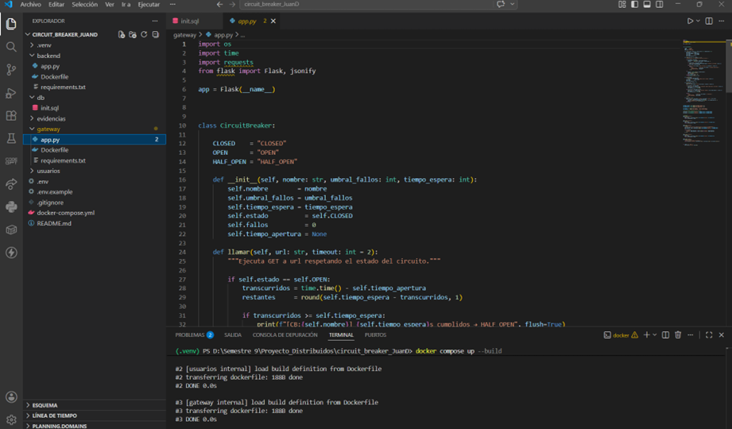
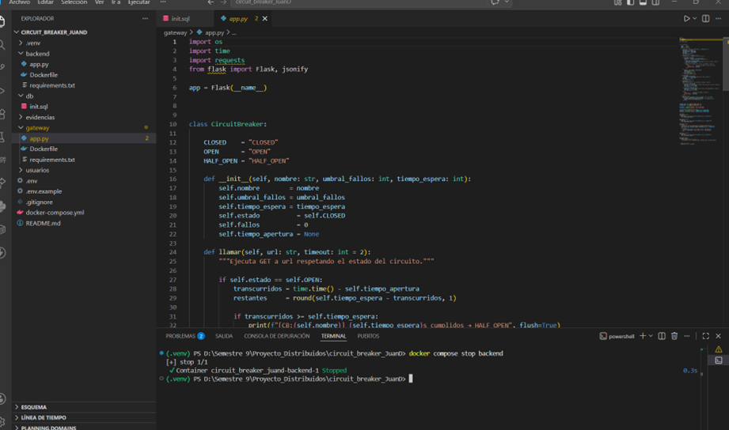
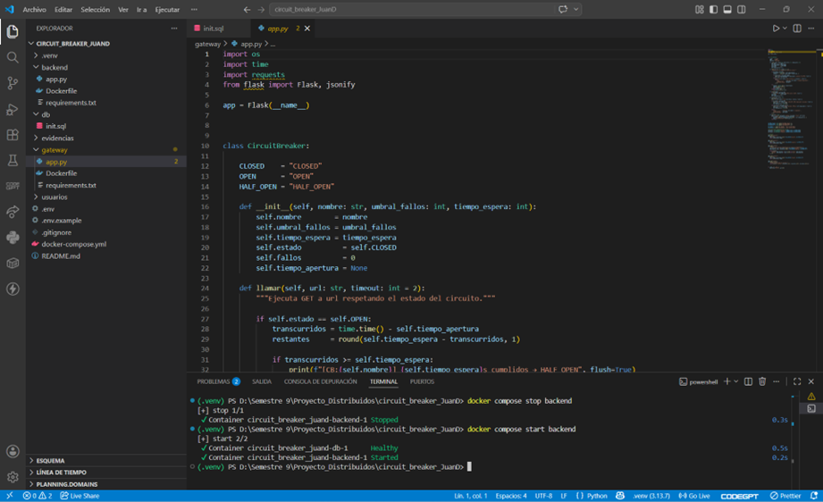
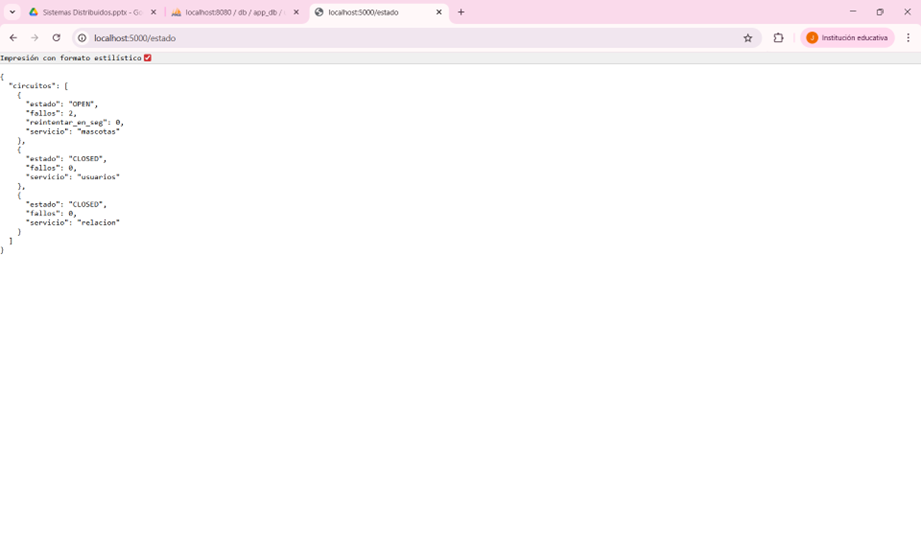

# Laboratorio: Circuit Breaker — Pet Shop

## Integrantes

- Juan David Bolaños Galindo
- [Nombre del compañero]

---

## Descripción

Este laboratorio implementa el patrón **Circuit Breaker** en un sistema Pet Shop con varios servicios.

El sistema tiene un **gateway en Flask** que recibe las peticiones y las envía a los servicios de:

- Mascotas
- Usuarios
- Relación
- Resumen

El Circuit Breaker permite controlar fallos. Si un servicio deja de responder, el gateway no insiste todo el tiempo, sino que abre el circuito, espera un tiempo y luego prueba si el servicio se recuperó.

---

## Requisitos

- Docker Desktop

---

## Estructura del proyecto

```bash
laboratorio_circuit_breaker/
├── docker-compose.yml
├── .env
├── .env.example
├── gateway/
│   └── app.py
├── usuarios/
│   └── app.py
├── backend/
│   └── app.py
└── db/
    └── init.sql
```

---

## Estructura de entrega

```bash
corte_3/
└── laboratorio_circuit_breaker/
    ├── README.md
    ├── docker-compose.yml
    ├── .env.example
    ├── gateway/
    │   └── app.py
    ├── usuarios/
    │   └── app.py
    ├── backend/
    │   └── app.py
    ├── db/
    │   └── init.sql
    └── evidencias/
        ├── fase1.png
        ├── fase2.png
        ├── fase3.png
        ├── fase4.png
        └── fase5.png
```

> El archivo `.env` no se sube al repositorio. Solo se sube `.env.example`.

---

## Levantar el proyecto

```bash
cp .env.example .env
docker compose up --build
```

Ver contenedores:

```bash
docker compose ps
```

Ver logs del gateway:

```bash
docker compose logs -f gateway
```

---

## Endpoints

| Endpoint | Descripción |
|---|---|
| `/mascotas` | Lista mascotas |
| `/usuarios` | Lista usuarios |
| `/resumen` | Consulta mascotas y usuarios |
| `/relacion` | Mascotas con datos del dueño |
| `/estado` | Estado de los circuitos |

Ejemplos:

```txt
http://localhost:5000/mascotas
http://localhost:5000/usuarios
http://localhost:5000/resumen
http://localhost:5000/relacion
http://localhost:5000/estado
```

---

## Configuración del Circuit Breaker

Las variables están en `.env`:

| Variable | Valor | Descripción |
|---|---:|---|
| `CB_UMBRAL_FALLOS` | 2 | Fallos necesarios para abrir el circuito |
| `CB_TIEMPO_ESPERA` | 30 | Tiempo antes de pasar a HALF_OPEN |
| `CB_TIMEOUT_HTTP` | 2 | Tiempo máximo por petición |

---

## Estados del Circuit Breaker

```txt
CLOSED → OPEN → HALF_OPEN → CLOSED
```

- `CLOSED`: el servicio funciona normalmente.
- `OPEN`: el servicio falló y se bloquean las peticiones.
- `HALF_OPEN`: se hace una prueba para saber si el servicio se recuperó.

---

# Fase 1 — Observar

## Qué se hizo

Se apagó el servicio de mascotas:

```bash
docker compose stop backend
```

Luego se hicieron varias peticiones a:

```txt
http://localhost:5000/mascotas
```

También se revisaron logs:

```bash
docker compose logs -f gateway
```

## Qué se observó

El gateway intentó comunicarse con el servicio de mascotas, pero al estar apagado empezó a fallar.

Después de varios fallos, el Circuit Breaker abrió el circuito.

## ¿Se protege o insiste?

El sistema se protege, porque cuando el circuito está en `OPEN`, deja de enviar peticiones al servicio caído durante un tiempo.

## Evidencia

```md

```

---

# Fase 2 — Aplicar

## Qué se hizo

Se aplicó el Circuit Breaker a varios endpoints del gateway:

```txt
/mascotas
/usuarios
/relacion
/resumen
```

Se creó un circuito independiente por servicio:

```python
cb_mascotas = CircuitBreaker("mascotas", CB_UMBRAL_FALLOS, CB_TIEMPO_ESPERA)
cb_usuarios = CircuitBreaker("usuarios", CB_UMBRAL_FALLOS, CB_TIEMPO_ESPERA)
cb_relacion = CircuitBreaker("relacion", CB_UMBRAL_FALLOS, CB_TIEMPO_ESPERA)
```

## Decisiones

Cada servicio debe tener su propio contador de fallos.

Esto permite que si falla mascotas, usuarios pueda seguir funcionando.

## Evidencia

```md

```

---

# Fase 3 — Investigar Half-Open

## Qué significa Half-Open

`HALF_OPEN` es un estado de prueba.

El circuito estaba abierto, ya pasó el tiempo de espera y el sistema permite una petición para verificar si el servicio se recuperó.

## Cuándo se vuelve a intentar

Se vuelve a intentar después del tiempo configurado en:

```bash
CB_TIEMPO_ESPERA=30
```

## Qué pasa si falla otra vez

Si el servicio vuelve a fallar en `HALF_OPEN`, el circuito regresa a `OPEN`.

## Qué pasa si funciona

Si responde correctamente, el circuito vuelve a `CLOSED`.

## Evidencia

```md

```

---

# Fase 4 — Implementar recuperación

## Qué se hizo

Se implementó recuperación con espera controlada.

Primero se apaga el servicio:

```bash
docker compose stop backend
```

Luego se hacen peticiones a:

```txt
http://localhost:5000/mascotas
```

Después se vuelve a iniciar el servicio:

```bash
docker compose start backend
```

Cuando pasa el tiempo definido, el circuito pasa a `HALF_OPEN`.

Si la prueba funciona, vuelve a `CLOSED`.

## Flujo

```txt
CLOSED → OPEN → HALF_OPEN → CLOSED
```

Si falla en la prueba:

```txt
HALF_OPEN → OPEN
```

## Evidencia

```md

```

---

# Fase 5 — Validar

## Escenario 1: Servicio funcionando

Con todos los servicios activos:

```bash
docker compose up --build
```

Prueba:

```txt
http://localhost:5000/estado
```

Resultado esperado:

```json
{
  "servicio": "mascotas",
  "estado": "CLOSED",
  "fallos": 0
}
```

---

## Escenario 2: Servicio caído

Se apaga el servicio:

```bash
docker compose stop backend
```

Se prueba:

```txt
http://localhost:5000/mascotas
```

Resultado esperado:

```json
{
  "error": "Servicio 'mascotas' no disponible.",
  "estado_circuito": "OPEN",
  "fallos_acumulados": 2
}
```

---

## Escenario 3: Circuito abierto

Cuando el circuito está abierto, el sistema no sigue insistiendo.

Resultado esperado:

```json
{
  "error": "Servicio 'mascotas' bloqueado temporalmente.",
  "estado_circuito": "OPEN",
  "reintentar_en_seg": 25
}
```

---

## Escenario 4: Recuperación

Se inicia nuevamente el servicio:

```bash
docker compose start backend
```

Después de esperar el tiempo configurado, se prueba otra vez.

Si funciona, el circuito vuelve a `CLOSED`.

---

## Escenario 5: Servicios independientes

Si falla mascotas, usuarios puede seguir funcionando.

Ejemplo en `/estado`:

```json
{
  "circuitos": [
    {
      "servicio": "mascotas",
      "estado": "OPEN",
      "fallos": 2
    },
    {
      "servicio": "usuarios",
      "estado": "CLOSED",
      "fallos": 0
    }
  ]
}
```

## Evidencia

```md

```

---

# Código implementado

El código principal está en:

```bash
gateway/app.py
```

Se implementó:

- Clase `CircuitBreaker`
- Estados `CLOSED`, `OPEN` y `HALF_OPEN`
- Contador de fallos por servicio
- Circuito independiente para mascotas
- Circuito independiente para usuarios
- Circuito independiente para relación
- Endpoint `/estado`
- Recuperación automática con `HALF_OPEN`

---

# Logs esperados

```bash
[CB:mascotas] Fallo #1
[CB:mascotas] Fallo #2
[CB:mascotas] Umbral alcanzado → OPEN por 30s
[CB:mascotas] OPEN — reintento en 25s
[CB:mascotas] 30s cumplidos → HALF_OPEN
[CB:mascotas] HALF_OPEN exitoso → CLOSED
```

---

# Comandos usados

```bash
docker compose up --build
docker compose ps
docker compose stop backend
docker compose start backend
docker compose logs -f gateway
```

---

# Análisis final

## ¿Qué cambió en el comportamiento del sistema?

Antes, el gateway podía seguir intentando conectarse a un servicio caído.

Ahora, con Circuit Breaker, el sistema detecta los fallos, abre el circuito, espera un tiempo y luego prueba si el servicio se recuperó.

Esto evita insistir sobre servicios no disponibles.

---

## ¿Qué decisiones se tomaron?

Se decidió usar un Circuit Breaker independiente por servicio.

Esto permite que cada servicio tenga su propio contador y estado.

También se agregó el estado `HALF_OPEN` para manejar la recuperación.

---

## ¿Qué dificultades se encontraron?

La principal dificultad fue entender que cada servicio debía manejar sus fallos de forma independiente.

También fue necesario revisar logs para validar los cambios de estado:

```txt
CLOSED
OPEN
HALF_OPEN
CLOSED
```

---

# Conclusión

El laboratorio permitió implementar un sistema que aprende a fallar de forma controlada.

El Circuit Breaker ayuda a proteger el gateway cuando un servicio no responde. Además, permite que otros servicios sigan funcionando aunque uno falle.

Con esta implementación, el sistema Pet Shop es más tolerante a fallos y más estable.